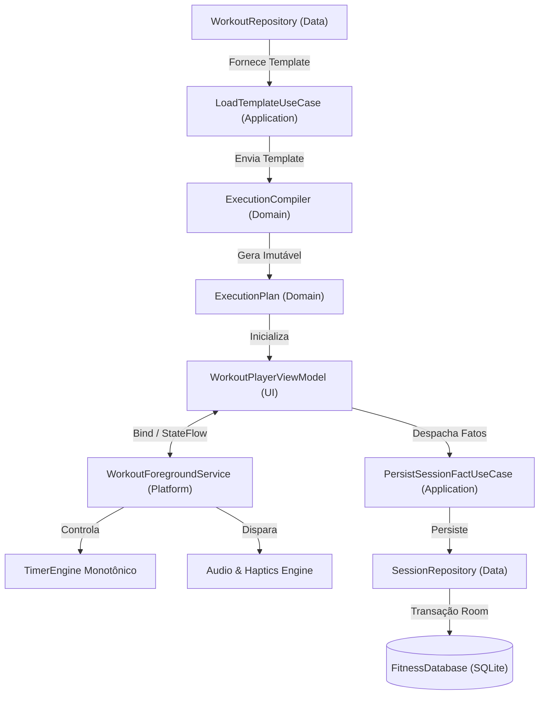

# FITNESS TRACKER PRO — ESPECIFICAÇÃO TÉCNICA DE IMPLEMENTAÇÃO
**Versão:** 1.0  
**Referência Arquitetural:** Documentação v3.2 & ADR-001 a ADR-034  
**Status:** Baseline Oficial de Engenharia de Software  

---

## 1. Objetivo do Documento

Este documento define o **contrato estrito de implementação** para a engenharia do aplicativo nativo Android **Fitness Tracker Pro**. O foco não é apenas descrever os requisitos de negócio, mas especificar **como o código-fonte deve ser estruturado, dividido em camadas, tipado e orquestrado** para implementar cada funcionalidade garantindo que nenhuma decisão de arquitetura tomada (ADR-001 a ADR-034) seja violada.

### O Axioma Canônico do Projeto:
> **Template é intenção. Session é fato histórico. ExecutionPlan é a representação imutável de execução.**

---

## 2. Baseline Tecnológico Obrigatório

- **Linguagem:** Kotlin 2.0+ (idiomático, estrito, imutável por padrão).
- **Ambiente:** Android Nativo (minSdk 26 - Android 8.0 Oreo, targetSdk 35).
- **Interface Gráfica:** Jetpack Compose + Material Design 3 (Dynamic Color desligado por padrão, paleta esportiva de alto contraste).
- **Navegação:** Jetpack Navigation Compose com rotas fortemente tipadas via Kotlin Serialization (`@Serializable`).
- **Persistência Local:** Room Database sobre SQLite (Room 2.6+ com KSP e schema export habilitado).
- **Assincronia e Reatividade:** Kotlin Coroutines, `StateFlow` e `SharedFlow`.
- **Serviço de Background:** `WorkoutForegroundService` com notificação persistente em canal de alta prioridade.
- **Relógio e Temporização:** `SystemClock.elapsedRealtime()` para qualquer cálculo temporal; `System.currentTimeMillis()` restrito a datas de calendário.
- **Áudio e Feedback:** `TextToSpeech` nativo pt-BR, `ToneGenerator`/arquivos PCM locais e `Vibrator`/`VibrationEffect`.
- **Intercâmbio de Dados:** Parser/Serializer XML nativo seguro (`XmlPullParser`), sem permissões externas ou expansão de entidades (prevenção contra XXE).
- **Topologia de Execução:** 100% Offline-first, zero dependência de nuvem, zero telemetria invasiva.

---

## 3. Topologia de Camadas (Clean Architecture Local)

```text
com.example.fitnesstrackerpro/
│
├── domain/            <-- Regras puras de negócio, entidades ricas, contratos de repositório,
│                          máquinas de estado e ExecutionCompiler (Zero Android framework).
│
├── application/       <-- Casos de uso (UseCases), orquestração de fluxo, DTOs de comando
│                          e importadores/exportadores de templates.
│
├── data/              <-- Implementação de persistência Room: entidades SQLite, DAOs,
│                          TypeConverters, transações e mappers Bidirecionais Data <-> Domain.
│
├── platform/          <-- Serviços Android: WorkoutForegroundService, TimerEngine monotônico,
│                          gerenciador de áudio (Audio Focus, TTS pt-BR) e hápticos.
│
└── ui/                <-- Camada Compose: Telas (Screens), Componentes reutilizáveis,
                           ViewModels, UI States imutáveis e navegação tipada.
```

### Regras Estritas de Dependência:
1. `domain` não depende de nenhuma outra camada e não importa pacotes `android.*` (exceto utilitários agnósticos de anotação caso necessário).
2. `application` depende exclusivamente de `domain`.
3. `data` implementa as interfaces de repositório definidas em `domain`, dependendo do Room e SQLite.
4. `platform` implementa contratos de runtime temporal e multimídia definidos em `domain` ou `application`.
5. `ui` consome `application` (Use Cases) e consome os `StateFlow` expostos pelos ViewModels; **a UI NUNCA acessa DAOs ou tabelas Room diretamente**.

---

## 4. Fluxo Canônico de Runtime



---

## 5. As 10 Regras Inegociáveis de Engenharia

1. **Imutabilidade do Template:** A execução de uma sessão de treino **nunca** altera os campos ou séries do `WorkoutTemplate`.
2. **Independência Histórica por Snapshot:** `WorkoutSession` armazena snapshots textuais dos exercícios e configurações dos blocos. A exclusão ou edição futura de um template ou exercício não quebra relatórios históricos.
3. **Canonicidade de Unidade (kg):** Todas as colunas de carga no banco (`targetLoadKg`, `actualLoadKg`) armazenam obrigatoriamente valores em **Quilogramas**. A exibição em Libras (lb) é puramente visual na UI.
4. **HIIT Baseado em Metas:** Blocos de HIIT registram apenas targets planejados. A V1 não finge medir métricas reais de equipamentos (esteira/bike/remo) sem sensores.
5. **Ferramentas Avulsas Isoladas:** O cronômetro, timers regressivos e AMRAP/EMOM da aba *Tools* operam de forma isolada e **nunca** geram registros na tabela `WorkoutSession`.
6. **Relógio Monotônico Obrigatório:** Toda lógica temporal de treino utiliza `SystemClock.elapsedRealtime()`. Wall clock (`currentTimeMillis`) é proibido para medir duração.
7. **Detentor de Estado no Foreground Service:** O `WorkoutForegroundService` é o guardião canônico do relógio monotônico ativo. A interface Compose conecta-se como observadora reativa, impedindo perda de treino por recreação de Activity.
8. **Separação entre Cancelamento e Descarte:**
   - `CANCELLED`: Interrupção voluntária pelo usuário preserva as séries executadas até o momento no histórico.
   - `DISCARDED`: Descarte explícito de rascunhos ou testes executa `DELETE CASCADE` físico de toda a árvore da sessão.
9. **Fronteira de Séries em Circuitos:** AMRAP e For Time gravam fatos consolidados em `AmrapResult` e `ForTimeResult`, sem gravar `PerformedSet` a cada repetição intermediária.
10. **XML Estritamente de Templates:** O arquivo XML exporta e importa exclusivamente moldes de treinos (`WorkoutTemplate`), sendo proibida a serialização de sessões, histórico ou dados biométricos.

---

## 6. Fases de Implementação e Entregáveis

- **Fase 0 — Fundação:** Configuração de build, KSP, Room Database baseline, navegação e injeção de dependência manual/robusta.
- **Fase 1 — Domínio & Musculação:** Modelos de Exercício, Editor de Templates, Execução de Séries Tradicionais, busca da última carga e histórico.
- **Fase 2 — Execution Engine & Runtime:** Compilador de execução, `ExecutionPlan`, `WorkoutForegroundService` integrado ao `TimerEngine` monotônico e recuperação de sessão.
- **Fase 3 — Protocolos Complexos:** Máquinas de estado para AMRAP, EMOM, For Time, HIIT e Alongamento unilateral alternado.
- **Fase 4 — Ferramentas (Tools) & XML:** Timers independentes da aba Tools e pipeline de importação/exportação XML com validação e preview.
- **Fase 5 — Hardening & Qualidade:** Testes de unidade no compilador, testes de concorrência e transação no Room, BDD e validação de áudio e background em dispositivos reais.
