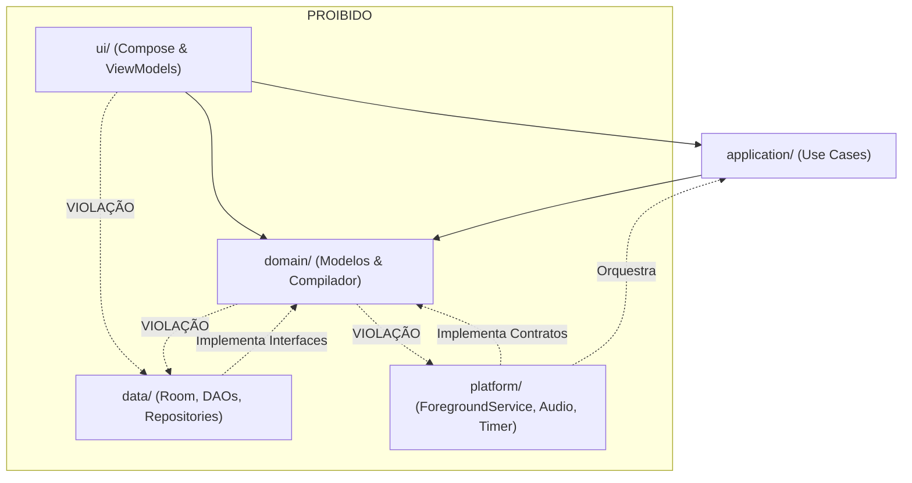

# ESTRUTURA DO PROJETO E CONTRATOS MODULARES
**Versão:** 1.0  
**Pacote Raiz:** `com.example.fitnesstrackerpro`  

---

## 1. Árvore Canônica de Pacotes

```text
com.example.fitnesstrackerpro/
├── FitnessTrackerApplication.kt         <-- Inicialização da aplicação, registro de canais de notificação
├── MainActivity.kt                      <-- Activity única (Single-Activity) hospedando o NavHost Compose
│
├── domain/                              <-- NÚCLEO DE DOMÍNIO (Pure Kotlin, sem dependência do Android)
│   ├── model/                           <-- Entidades puras (Exercise, WorkoutTemplate, PlannedSet, Session...)
│   │   ├── Exercise.kt
│   │   ├── WorkoutTemplate.kt
│   │   ├── WorkoutBlock.kt
│   │   ├── PlannedSet.kt
│   │   ├── WorkoutSession.kt
│   │   ├── SessionBlock.kt
│   │   ├── ExercisePerformance.kt
│   │   ├── PerformedSet.kt
│   │   ├── Results.kt                  <-- AmrapResult, EmomIntervalResult, ForTimeResult...
│   │   └── PersonalRecord.kt
│   ├── execution/                       <-- Máquina de execução e compilador
│   │   ├── ExecutionPlan.kt
│   │   ├── ExecutionStep.kt
│   │   ├── ExecutionCompiler.kt
│   │   └── ExecutionState.kt
│   ├── timer/                           <-- Modelos e eventos de tempo agnósticos
│   │   ├── TimerState.kt
│   │   └── TimerEvent.kt
│   └── repository/                      <-- Interfaces de Repositório (Contratos do Domínio)
│       ├── WorkoutRepository.kt
│       ├── SessionRepository.kt
│       ├── ExerciseRepository.kt
│       └── HistoryRepository.kt
│
├── application/                         <-- CASOS DE USO E ORQUESTRAÇÃO
│   ├── workout/                         <-- CreateTemplateUseCase, UpdateTemplateUseCase...
│   ├── session/                         <-- StartSessionUseCase, CompleteSetUseCase, CancelWorkoutUseCase...
│   ├── history/                         <-- GetSessionDetailUseCase, GetLastLoadByExerciseAndSetUseCase...
│   ├── exercise/                        <-- SearchExercisesUseCase, CreateCustomExerciseUseCase...
│   ├── timer/                           <-- ControlIndependentTimerUseCase...
│   └── xml/                             <-- ValidateXmlUseCase, PreviewXmlImportUseCase, ExportTemplateXmlUseCase...
│
├── data/                                <-- PERSISTÊNCIA ROOM & REPOSITÓRIOS
│   ├── local/
│   │   ├── entity/                      <-- Entidades com anotações Room (@Entity)
│   │   │   ├── ExerciseEntity.kt
│   │   │   ├── WorkoutTemplateEntity.kt
│   │   │   ├── WorkoutBlockEntity.kt
│   │   │   ├── WorkoutExerciseEntity.kt
│   │   │   ├── PlannedSetEntity.kt
│   │   │   ├── WorkoutSessionEntity.kt
│   │   │   ├── SessionBlockEntity.kt
│   │   │   ├── ExercisePerformanceEntity.kt
│   │   │   ├── PerformedSetEntity.kt
│   │   │   ├── AmrapResultEntity.kt
│   │   │   ├── EmomIntervalResultEntity.kt
│   │   │   ├── ForTimeResultEntity.kt
│   │   │   ├── ForTimeRemainingItemEntity.kt
│   │   │   ├── PersonalRecordEntity.kt
│   │   │   └── TimerRecoveryEntity.kt
│   │   ├── dao/                         <-- Data Access Objects com @Dao
│   │   │   ├── ExerciseDao.kt
│   │   │   ├── WorkoutTemplateDao.kt
│   │   │   ├── WorkoutSessionDao.kt
│   │   │   ├── HistoryDao.kt
│   │   │   └── TimerRecoveryDao.kt
│   │   ├── relation/                    <-- Agregados Room (@Relation, @Transaction)
│   │   │   ├── TemplateWithBlocksRelation.kt
│   │   │   └── SessionWithPerformanceRelation.kt
│   │   ├── converter/                   <-- TypeConverters Room para JSON tipado e Enums
│   │   └── FitnessDatabase.kt           <-- RoomDatabase abstrato
│   ├── mapper/                          <-- Conversores Entity <-> Domain Model
│   └── repository/                      <-- Implementações concretas dos repositórios
│       ├── WorkoutRepositoryImpl.kt
│       ├── SessionRepositoryImpl.kt
│       ├── ExerciseRepositoryImpl.kt
│       └── HistoryRepositoryImpl.kt
│
├── platform/                            <-- SERVIÇOS E HARDWARE ANDROID
│   ├── service/                         <-- WorkoutForegroundService.kt (Detentor do Timer ativo)
│   ├── timer/                           <-- MonotonicTimerEngineImpl.kt
│   ├── audio/                           <-- AudioFocusController.kt, VoiceCoachTts.kt, TonePlayer.kt
│   ├── haptics/                         <-- HapticFeedbackController.kt
│   └── notification/                    <-- WorkoutNotificationManager.kt
│
└── ui/                                  <-- INTERFACE JETPACK COMPOSE & VIEWMODELS
    ├── navigation/                      <-- Rotas tipadas, BottomBar e NavHost
    │   ├── Routes.kt
    │   └── AppNavHost.kt
    ├── theme/                           <-- Theme, Color, Type, Shape (Design System)
    ├── components/                      <-- Botões táteis grandes, Cards, Modais, Inputs de carga
    ├── screens/
    │   ├── home/                        <-- HomeScreen & HomeViewModel
    │   ├── workouts/                    <-- WorkoutsListScreen, TemplateEditorScreen, ExerciseLibraryScreen
    │   ├── player/                      <-- WorkoutPlayerScreen & WorkoutPlayerViewModel
    │   ├── history/                     <-- HistoryScreen, SessionDetailScreen, PrScreen
    │   └── tools/                       <-- StopwatchScreen, IntervalScreen, AmrapScreen, XmlExchangeScreen
```

---

## 2. Regras Estritas de Dependência e Isolamento



### Proibições Absolutas:
1. **Nenhum DAO no Compose:** A camada `ui` nunca referencia `*Dao`, `*Entity` ou `FitnessDatabase`.
2. **Nenhum Framework no Domínio:** Classes no pacote `domain` não importam `android.content.Context`, `android.os.*`, `androidx.compose.*`. O domínio é 100% testável com testes de unidade puros na JVM.
3. **Mapeamento Obrigatório na Borda de Dados:** A camada `data` sempre converte objetos `*Entity` em modelos puros de `domain` antes de retorná-los para `application` ou `ui`.

---

## 3. Padrão Unificado de ViewModel e MVI Leve

Cada tela ou fluxo crítico adota o padrão de Estado Unificado e Eventos Desacoplados:

```kotlin
// 1. Estado imutável da tela
data class WorkoutPlayerUiState(
    val currentStepIndex: Int = 0,
    val totalSteps: Int = 0,
    val exerciseName: String = "",
    val targetLoadKg: Double? = null,
    val targetReps: Int? = null,
    val actualLoadInput: String = "",
    val actualRepsInput: String = "",
    val remainingSeconds: Long = 0L,
    val isRunning: Boolean = false,
    val isPaused: Boolean = false,
    val isCircuit: Boolean = false,
    val circuitRoundsCompleted: Int = 0
)

// 2. Ações disparadas pela UI (Intenções do Usuário)
sealed interface WorkoutPlayerAction {
    data object TogglePlayPause : WorkoutPlayerAction
    data object CompleteCurrentSet : WorkoutPlayerAction
    data class UpdateActualLoad(val load: String) : WorkoutPlayerAction
    data class UpdateActualReps(val reps: String) : WorkoutPlayerAction
    data object IncrementCircuitRound : WorkoutPlayerAction
    data object DecrementCircuitRound : WorkoutPlayerAction
    data object SkipStep : WorkoutPlayerAction
    data object RequestCancelWorkout : WorkoutPlayerAction
    data object RequestDiscardWorkout : WorkoutPlayerAction
}

// 3. Eventos de efeito único (Navegação, Toast, Diálogos)
sealed interface WorkoutPlayerEffect {
    data class NavigateToSummary(val sessionId: Long) : WorkoutPlayerEffect
    data object NavigateBack : WorkoutPlayerEffect
    data class ShowToast(val message: String) : WorkoutPlayerEffect
    data class ShowDiscardConfirmation(val message: String) : WorkoutPlayerEffect
}

// 4. Estrutura do ViewModel
abstract class BaseViewModel<State, Action, Effect>(initialState: State) : ViewModel() {
    val uiState: StateFlow<State>
    val effect: SharedFlow<Effect>
    abstract fun onAction(action: Action)
}
```

---

## 4. Injeção de Dependências e Service Locators

Para manter a simplicidade e independência sem sobrecarga de frameworks complexos, o projeto utiliza um **Dependency Container de Instâncias Únicas** gerenciado em nível de aplicação (`AppContainer`):

```kotlin
interface AppContainer {
    val database: FitnessDatabase
    val workoutRepository: WorkoutRepository
    val sessionRepository: SessionRepository
    val exerciseRepository: ExerciseRepository
    val historyRepository: HistoryRepository
    val executionCompiler: ExecutionCompiler
}

class DefaultAppContainer(private val context: Context) : AppContainer {
    override val database: FitnessDatabase by lazy {
        FitnessDatabase.buildDatabase(context)
    }
    
    override val workoutRepository: WorkoutRepository by lazy {
        WorkoutRepositoryImpl(database.workoutTemplateDao(), database.workoutBlockDao())
    }

    override val sessionRepository: SessionRepository by lazy {
        SessionRepositoryImpl(database, database.workoutSessionDao())
    }

    override val exerciseRepository: ExerciseRepository by lazy {
        ExerciseRepositoryImpl(database.exerciseDao())
    }

    override val historyRepository: HistoryRepository by lazy {
        HistoryRepositoryImpl(database.historyDao())
    }

    override val executionCompiler: ExecutionCompiler by lazy {
        DefaultExecutionCompiler()
    }
}
```
Isso viabiliza a criação de `MockAppContainer` ou injeção direta de dublês de teste em qualquer camada com 100% de previsibilidade e sem reflexão.
