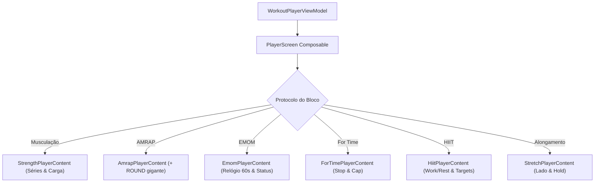

# JETPACK COMPOSE, MATERIAL 3 & EXPERIÊNCIA DE USO (UX)
**Versão:** 1.0  
**Camada:** `ui/` (Compose UI, ViewModels, Design System e Navegação)  

---

## 1. Navegação Fortemente Tipada (Navigation Compose)

O aplicativo utiliza a abordagem moderna de navegação baseada em classes serializáveis (`kotlinx.serialization`):

```kotlin
package com.example.fitnesstrackerpro.ui.navigation

import kotlinx.serialization.Serializable

sealed interface ScreenRoute {
    // 4 Pilares Principais (BottomBar)
    @Serializable data object Home : ScreenRoute
    @Serializable data object Workouts : ScreenRoute
    @Serializable data object History : ScreenRoute
    @Serializable data object Tools : ScreenRoute

    // Telas Secundárias e Modais
    @Serializable data class TemplateEditor(val templateId: Long? = null) : ScreenRoute
    @Serializable data class ExerciseLibrary(val selectMode: Boolean = false) : ScreenRoute
    @Serializable data class WorkoutPlayer(val templateId: Long) : ScreenRoute
    @Serializable data class SessionDetail(val sessionId: Long) : ScreenRoute
    @Serializable data class XmlExchange(val isImport: Boolean = true) : ScreenRoute
    @Serializable data object PersonalRecords : ScreenRoute
}
```

---

## 2. Design System para Condições Reais de Academia

A interface do **Fitness Tracker Pro** foi concebida para operar sob condições físicas adversas: **mãos suadas, respiração ofegante, trepidação em esteiras e operação com uma só mão**.

### 2.1. Tokens Visuais de Alto Contraste (Dark Theme Nativo)
- **Fundo Principal (Deep Void):** `#0D1117`
- **Superfície de Cards (Dark Charcoal):** `#161B22`
- **Borda e Elevação:** `#21262D`
- **Verde Ação / Trabalho Ativo (Sprint Green):** `#00E676`
- **Ciano Descanso / Recuperação (Cyan Pulse):** `#00D2FF`
- **Âmbar Alerta / 10 Segundos (Warning Amber):** `#FFB300`
- **Vermelho Descarte / Cancelar (Crimson Danger):** `#FF3B30`
- **Texto Primário:** `#FFFFFF` (100% opacidade)
- **Texto Secundário / Labels:** `#8B949E`

### 2.2. Diretrizes de Ergonomia Tátil
1. **Touch Targets Generosos:** Botões de ação primária (ex: *Concluir Série*, *+ ROUND*) possuem altura mínima de **72 dp** e preenchem toda a largura utilizável da tela.
2. **Prevenção de Toques Acidentais:** Ações destrutivas (*Descartar Treino*, *Cancelar*) nunca são acionadas em toque único; exigem modal de confirmação com visualização clara do impacto histórico.
3. **Números Monospaçados e Gigantes:** Timers regressivos e contadores de carga utilizam tipografia com numerais tabulares (*FontFeatureSettings = "tnum"*), prevenindo oscilações visuais na tela durante o ticking dos segundos.

---

## 3. Interfaces Especializadas por Protocolo no Player



### 3.1. Musculação Tradicional (`StrengthPlayerContent`)
- Exibe o exercício atual, série corrente (`Série 2 de 4`), peso alvo e repetições alvo.
- **Campo de Carga Inteligente:** Exibe a sugestão pré-carregada da última carga realizada naquele mesmo exercício e série. O atleta pode tocar nos steppers de `+2 kg` / `-2 kg` ou digitar diretamente.
- **Botão Primário:** `CONCLUIR SÉRIE` (verde dominante de 72dp). Ao tocar, inicia imediatamente o timer regressivo de descanso com transição suave.

### 3.2. AMRAP (`AmrapPlayerContent`)
- O centro da tela é dominado por dois elementos:
  1. O cronômetro regressivo gigante em contagem decrescente.
  2. O contador de rounds completados (`ROUNDS: 7`).
- **Botão Gigante Primário:** `+ ROUND` (ocupa metade inferior da tela para clique cego durante a corrida contra o relógio).
- **Botão Secundário:** `- ROUND` (pequeno, no canto superior para correção de toques duplos acidentais).

### 3.3. HIIT Intervalado (`HiitPlayerContent`)
- **Indicador de Fase:** Barra visual com cores dinâmicas: Verde vivo durante `TIRO (WORK)` e Azul ciano durante `DESCANSO (REST)`.
- **Rótulo Explícito de Metas:** Exibe os alvos de equipamento de forma cristalina:
  - *ESTEIRA: ALVO 14.0 KM/H | INCLINAÇÃO 2%*
  - Em nenhuma hipótese a interface sugere que esses números são medições em tempo real da esteira física (respeitando ADR-005).

### 3.4. Alongamento Unilateral (`StretchPlayerContent`)
- Exibe visualmente o lado ativo em letras garrafais e cores distintas:
  - `LADO DIREITO` (com contador regressivo de sustentação).
  - Transição de 3 a 5 segundos com aviso vocal: *"Prepare-se para trocar de lado"*.
  - `LADO ESQUERDO` (com contador regressivo de sustentação).

---

## 4. Regra de Apresentação de Carga: kg vs lb

A camada de dados armazena obrigatoriamente **Quilogramas (`kg`)**. Quando o atleta opta por Libras (`lb`) nas preferências do perfil:
- **Exibição:** A UI formata `actualLoadKg * 2.20462` arredondado para 1 casa decimal com o sufixo `lb`.
- **Entrada:** Ao digitar um peso em Libras no player, o ViewModel converte o valor para Quilogramas (`inputLb / 2.20462`) antes de despachar a ação `ConfirmSet(actualLoadKg = ...)`.
- Nenhuma lógica interna de tonelagem ou consultas Room é alterada.
