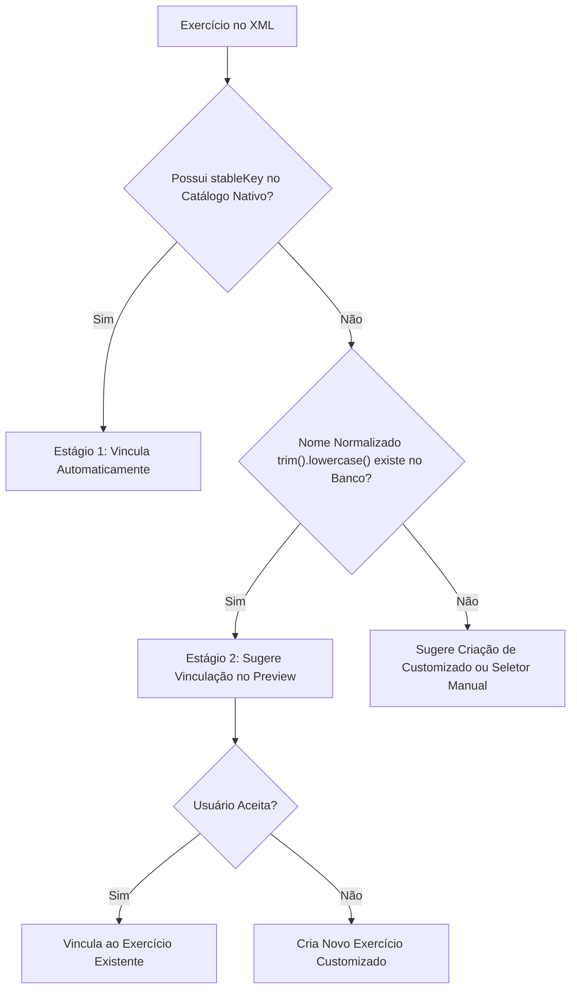

# INTERCÂMBIO DE DADOS XML — ESPECIFICAÇÃO TÉCNICA
**Versão:** 1.0  
**Camada:** `application/xml/` e `data/local/`  

---

## 1. Escopo e Fronteiras de Segurança

O mecanismo de exportação e importação XML tem como propósito único a **portabilidade de rotinas e moldes de treino (`WorkoutTemplate`)** entre usuários e dispositivos.

### Fronteiras de Privacidade e Integridade:
- **O XML NUNCA Serializa:** Sessões realizadas (`WorkoutSession`), séries executadas, cargas reais, repetições realizadas, recordes pessoais (PR), notas pessoais ou chaves primárias internas (`Long PK`) do banco de dados SQLite.
- **Proteção contra XXE (XML External Entity):** O parser Android nativo (`XmlPullParser`) é configurado de forma estritamente segura:
  ```kotlin
  val factory = XmlPullParserFactory.newInstance().apply {
      isNamespaceAware = true
      setFeature(XMLConstants.FEATURE_SECURE_PROCESSING, true)
  }
  ```
  Entidades externas, referências a DTDs e expansões de rede são desabilitadas, prevenindo ataques de injeção ou exaustão de memória.

---

## 2. Estrutura do Documento e Identificadores Portáteis

```xml
<?xml version="1.0" encoding="utf-8"?>
<workoutTemplate 
    templateUuid="c8b4f172-2e5b-4c74-9f01-9a7c64a5d84e"
    schemaVersion="3.2"
    xmlns="urn:fitness-app:workout-template">
    
    <metadata>
        <name>Treino Superior Hipertrofia</name>
        <modality>STRENGTH</modality>
        <protocol>STANDARD_STRENGTH</protocol>
        <description>Foco em peito, ombros e tríceps com pausas estritas.</description>
        <estimatedDurationSeconds>3600</estimatedDurationSeconds>
    </metadata>

    <blocks>
        <block position="1" type="WORK" name="Supino Reto">
            <rounds>1</rounds>
            <exercises>
                <exercise key="barbell-bench-press" name="Supino Reto com Barra">
                    <sets>
                        <set number="1" targetReps="10" targetLoadKg="80.0" restSeconds="90" sideMode="BILATERAL"/>
                        <set number="2" targetReps="8" targetLoadKg="85.0" restSeconds="90" sideMode="BILATERAL"/>
                        <set number="3" targetReps="6" targetLoadKg="90.0" restSeconds="120" sideMode="BILATERAL"/>
                    </sets>
                </exercise>
            </exercises>
        </block>
    </blocks>
</workoutTemplate>
```

---

## 3. Pipeline de Importação em 2 Estágios para Exercícios

Para evitar a proliferação desordenada de exercícios duplicados no catálogo local:



### Regras de Resolução:
1. **Estágio 1 (Match por Chave Estável):** Exercícios com chaves como `barbell-bench-press` ou `dumbbell-lateral-raise` são resolvidos instantaneamente contra o catálogo nativo do app.
2. **Estágio 2 (Match por Nome Normalizado):** Se um exercício vier sem chave ou como customizado (ex: `"  supino inclinado halteres "`), o sistema normaliza o nome (`name.trim().lowercase()`) e pesquisa no banco. Se houver correspondência exata, o diálogo de Preview apresenta a opção:
   - *"O exercício 'Supino Inclinado com Halteres' já existe no seu catálogo. Deseja vinculá-lo a este treino?"*
   - O usuário pode aceitar a vinculação (mantendo a consistência do histórico) ou optar por criar uma entidade customizada separada.

---

## 4. Gerenciamento de Duplicidade de UUID

Se o arquivo importado contiver um `templateUuid` que já existe no banco de dados local:
1. **Política Padrão (Importar como Novo):** O sistema gera um **novo UUID v4** para o template importado, mantendo o original intacto e adicionando o sufixo `(Cópia)` ao nome.
2. **Substituição Explícita:** Se o usuário escolher explicitamente substituir, o template existente é atualizado, desde que não haja violação de integridade.
3. **Cancelamento:** O usuário pode descartar a importação sem que nenhum dado seja alterado.

---

## 5. Atomicidade Transacional Completa

A gravação dos dados importados ocorre exclusivamente através de uma transação Room atômica:

```kotlin
class ImportWorkoutTemplateUseCase(
    private val database: FitnessDatabase,
    private val exerciseDao: ExerciseDao,
    private val templateDao: WorkoutTemplateDao,
    private val blockDao: WorkoutBlockDao
) {
    suspend fun execute(confirmedPlan: ValidatedImportPlan): Long = database.withTransaction {
        // 1. Cria exercícios customizados aprovados pelo usuário (se houver)
        confirmedPlan.customExercisesToCreate.forEach { customEx ->
            exerciseDao.insert(customEx.toEntity())
        }

        // 2. Insere o cabeçalho do WorkoutTemplate
        val templateId = templateDao.insert(confirmedPlan.templateEntity)

        // 3. Insere todos os Blocos, Exercícios e Séries Planejadas em lote
        confirmedPlan.blocks.forEach { block ->
            val blockId = blockDao.insertBlock(block.entity.copy(templateId = templateId))
            block.exercises.forEach { ex ->
                val exId = blockDao.insertExercise(ex.entity.copy(blockId = blockId))
                blockDao.insertPlannedSets(ex.sets.map { it.copy(workoutExerciseId = exId) })
            }
        }

        templateId // Retorna o ID gerado; se qualquer insert falhar, o Room efetua rollback total
    }
}
```
Isso garante a impossibilidade absoluta de "templates corrompidos" ou "blocos órfãos" no banco.
